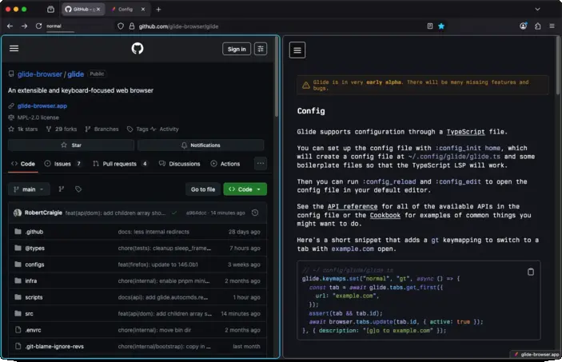


#changelog {
padding-top: unset !important;
margin-top: unset !important;
margin-bottom: unset !important;
}
article h1 {
font-size: revert !important;
padding-top: revert !important;
margin-top: 30px !important;
margin-bottom: revert !important;
}
article li {
padding: 0.3em;
}


# Changelog

# 0.1.56a

## Breaking changes 

### Hint callback execution 

The `action` and `pick` callbacks are now executed in the main process, _not_ the content process. This change was made so that you can access the `glide` API in the callbacks, making them much more useful.

For example, only selecting the hint with the largest width:

```typescript 
// before
glide.hints.show({
  pick: (hints) => {
    let biggest_hint = hints[0]!;
    let biggest_width = hints[0]!.element.offsetWidth;
    for (let i = 1; i < hints.length; i++) {
      const hint = hints[i]!;
      const width = hint.element.offsetWidth;
      if (width > biggest_width) {
        biggest_hint = hint;
        biggest_width = width;
      }
    }
    return [biggest_hint];
  },
});

// after
glide.hints.show({
  pick: async ({ hints, content }) => {
    const widths = await content.map((element) =>
      element.offsetWidth
    );
    let biggest_hint = hints[0]!;
    let biggest_width = widths[0]!;
    for (let i = 1; i < hints.length; i++) {
      const hint = hints[i]!;
      const width = widths[i]!;
      if (width > biggest_width) {
        biggest_hint = hint;
        biggest_width = width;
      }
    }
    return [biggest_hint];
  },
});
```

For the `action` function:

```typescript 
// before
glide.hints.show({
  action: (element) => {
    element.click();
  },
});

// after
glide.hints.show({
  action: async ({ content }) => {
    await content.execute((element) => element.click());
  },
});
```

### Relative path resolution 

Previously calls to APIs like [`glide.fs.read()`](api.md#glide.fs.read) with relative paths would resolve relative to the config file instead of the current file.

For example:

```typescript 
// <config>/glide.ts
glide.unstable.include("foo/bar/stuff.glide.ts");

// <config>/foo/bar/stuff.glide.ts
glide.fs.read("data.json");
```

0.1.55a would read `path:<config>/data.json`

0.1.56a will now read `path:<config>/foo/bar/data.json`

## Custom hint label generators 

You can now override label generation for hints to use whatever strategy you'd like.

For example, a _very_ naive implementation for using the first two characters of the element text as the label:

```typescript
glide.hints.show({
  label_generator: async ({ content }) => {
    const texts = await content.map((element) =>
      element.textContent!
    );
    return texts.map((text) => text.slice(0, 2));
  },
});
```

Thanks to [@peff](https://github.com/peff) for the contribution!

## Changes 

- Bumped Firefox from 146.0b9 to 147.0b3
- Added support for nested [`glide.unstable.include()`](api.md#glide.unstable.include) calls
- Added [`glide.modes.list()`](api.md#glide.modes.list)
- Added [`glide.commandline.is_active()`](api.md#glide.commandline.is_active)
- Added support for overriding commandline custom option matching so you can bring your own fuzzy finder
- Added `<CR>` keymapping to accept the hint with typed label
  - This is helpful for custom label generator functions that may define labels with the same prefix
  - Thanks to [@peff](https://github.com/peff) for the contribution!
- Added support for [`DOM.create_element()`](api.md#DOM.create_element) in the content process
- Fixed [`glide.o.switch_mode_on_focus`](api.md#glide.o.switch_mode_on_focus) disabling certain non-focus mode changes
- Fixed keymap types to correctly allow `<leader>-`, `<<`, `<` and other similar sequences
  - Thanks to [@suveshmoza](https://github.com/suveshmoza) for the contribution!
- Fixed repeated [`glide.styles.remove()`](api.md#glide.styles.remove) calls with the same ID
- Fixed [`glide.styles.add()`](api.md#glide.styles.add) erroneously adding duplicate styles
- Fixed static properties / methods on builtin classes not being accessible, e.g. `URL.canParse()`
- Fixed `GlideProcessError` not being exposed to the sandbox
- Fixed [`glide.hints.show()`](api.md#glide.hints.show) with `auto_activate: true` not respecting `action: () => ...`
- Fixed elements returned by commandline options `render()` functions from being needlessly duplicated, and breaking references

# 0.1.55a

### Picker API 

You can now use the commandline as a picker for arbitrary options.

For example, creating a basic version of `:tab` that only shows bookmarks:

```typescript
glide.keymaps.set("normal", "<leader>o", async () => {
  const bookmarks = await browser.bookmarks.getRecent(10);

  glide.commandline.show({
    title: "bookmarks",
    options: bookmarks.map((bookmark) => ({
      label: bookmark.title,
      async execute() {
        const tab = await glide.tabs.get_first({
          url: bookmark.url,
        });
        if (tab) {
          await browser.tabs.update(tab.id, {
            active: true,
          });
        } else {
          await browser.tabs.create({
            active: true,
            url: bookmark.url,
          });
        }
      },
    })),
  });
}, { description: "Open the bookmarks picker" });
```

You can also customise how each option is displayed by providing a `render()` function on each `option` that returns a `HTMLElement`:

```typescript 
{
  label: bookmark.title,
  render() {
    return DOM.create_element("div", {
      style: {
        display: "flex",
        alignItems: "center",
        gap: "8px",
      },
      children: [
        DOM.create_element("span", [bookmark.title]),
        DOM.create_element("span", [bookmark.url], {
          style: { color: "#777", fontSize: "0.9em" },
        }),
      ],
    });
  },
};
```

See the full commandline [docs](./commandline.md) for more information.

### Split views API 

> [!WARNING]
> This feature is very [early](https://connect.mozilla.org/t5/ideas/split-screen-tab-in-tab-feature-view-more-than-one-tab-at-once/idi-p/3989) in development in Firefox, there will be bugs.

Firefox has work in progress support for split views, so you can view multiple tabs at the same time.



You can now manage split views directly from the Glide config with [`glide.unstable.split_views`](./api.md#glide.unstable.split_views), for example:

```typescript
glide.keymaps.set(
  "normal",
  "<C-w>v",
  async ({ tab_id }) => {
    const all_tabs = await glide.tabs.query({});
    const current_index = all_tabs.findIndex((t) =>
      t.id === tab_id
    );
    const other = all_tabs[current_index + 1];
    if (!other) {
      throw new Error("No next tab");
    }
    glide.unstable.split_views.create([tab_id, other]);
  },
  {
    description:
      "Create a split view with the tab to the right",
  },
);

glide.keymaps.set(
  "normal",
  "<C-w>q",
  async ({ tab_id }) => {
    glide.unstable.split_views.separate(tab_id);
  },
  {
    description: "Close the split view for the current tab",
  },
);
```

### Changes 

- Bumped Firefox from 146.0b4 to 146.0b9
- Added `gU` keymapping to go to the root of the current URL hierarchy
- Added `gu` keymapping to go up the URL hierarchy
- Added [`CommandLineExit`](./autocmds.md#CommandLineExit) autocmd
- Added [`glide.commandline.show()`](./api.md#glide.commandline.show())
- Added support for removing autocmds with [`glide.autocmds.remove()`](./api.md#glide.autocmds.remove)
- Added [`glide.content.fn()`](./api.md#glide.content.fn) for marking callbacks as executing in the content process, currently supported in `glide.keymaps.set()` and `glide.excmds.create()`
- Added [`glide.o.switch_mode_on_focus`](./api.md#glide.o.switch_mode_on_focus) for disabling automatic mode switching
- Added `children` syntax sugar to [`DOM.create_element()`](./api.md#DOM.create_element) so you can now do `DOM.create_element('div', ['child'], { ...props })`
- Made the [`glide.o`](./api.md#glide.o) type extensible
- Fixed [`glide.keys.send()`](./api.md#glide.keys.send) potentially resulting in out-of-order key events
- Fixed the [`glide.o.yank_highlight`](./api.md#glide.o.yank_highlight) type to allow `rgb(255, 255, 255)` strings

# 0.1.54a

Page navigation keys (`h`, `j`, `k`, `l`, `<C-u>`, `<C-d>`, `gg`, and `G`) are now translated into equivalent standard keys:

- `hjkl` to arrow keys
- `<C-u>` to `<PageUp>`
- `<C-d>` to `<PageDown>`
- `gg` to `<D-Up>` on macOS, and `<C-Home>` on Linux
- `G` to `<D-Down>` on macOS, and `<C-End>` on Linux

For example, when you press `j`, Glide will now send an `<ArrowDown>` event to the web page.

This change was made for a couple reasons:

1. We get to leverage Firefox's smooth scrolling implementation.
2. The aforementioned keys are now more likely to _just work_ as you'd expect.
   Scrolling in PDFs now works; websites with their own scrolling behaviour will now work, as long as they support standard navigation keys.

#### Website key events 

There is a notable behaviour change here now that navigation keys send key events to the web page; websites can now intercept those key events and function differently. This may or may not be desirable depending on the website you are using.

If this behaviour is worse for you, please open a [discussion](https://github.com/glide-browser/glide/discussions), and if needed you can revert to the previous implementation with:

```typescript
glide.o.scroll_implementation = "legacy";
```

> [!TIP]
> This behaviour can be worse when custom elements are focused, e.g. YouTube videos as `j` will turn the volume down when you really want to scroll the page.
>
> In these cases you can try pressing `<C-,>` first to move focus off of that element.

### Smooth scrolling 

Smooth scrolling is now supported, and enabled by default.

If you want to keep instant scrolling you can use this config:

```typescript
glide.prefs.set("general.smoothScroll", false);
```

Note that this also changes the scroll behaviour when using arrow keys directly.

### Changes 

- Bumped Firefox from 145.0b6 to 146.0b3
- Added `I` motion support
- Added `<C-,>` to move focus out of the currently active element
- Added `:copy` excmd for smoother integration with excmds like `:profile_dir`
- Added support for removing browser styles with [`glide.styles.remove()`](api.md#glide.styles.remove)
- Added opt-in support for hinting elements with `click` listeners
  - See [#110](https://github.com/glide-browser/glide/discussions/110) for more information
- Added [`glide.ctx.version`](api.md#glide.ctx.version) for accessing the current Glide version
- Added [`glide.ctx.firefox_version`](api.md#glide.ctx.firefox_version) for accessing the Firefox version that Glide is based off of
- Added opt-in JPEG XL support
  - Thanks to [@SED4906](https://github.com/SED4906) for the contribution!
- Removed relative path limitations in [`glide.unstable.include()`](api.md#glide.unstable.include), you can now pass absolute paths
- Fixed scrolling while editable elments are focused, e.g. `<C-d>` will now actually scroll the page down.
- Fixed `path:org.mozilla` references in DBus names on Linux, we now use `path:app.glide_browser` instead
  - Thanks [@thomascft](https://github.com/thomascft) for the contribution!
- Fixed a case where Glide would automatically exit `ignore` mode when switching tabs
- Fixed keymappings conflicting with browser UI modals, e.g. `<D-q>` on macOS / `<C-S-w>` on Linux
- Updated `:clear` to also dismiss app menu notifications, e.g. the "New update available" notification
- Disabled more AI prefs
- We now store the previous Glide versions you've used in the profile directory

# 0.1.53a

### Addons API 

You can now install addons directly from the Glide config:

```typescript 
glide.addons.install(
  "https://addons.mozilla.org/firefox/downloads/file/4598854/ublock_origin-1.67.0.xpi",
);
```

This will install the [uBlock Origin](https://addons.mozilla.org/en-GB/firefox/addon/ublock-origin) addon, if it isn't _already_ installed. If you want to install the addon even if it's installed already, use `glide.addons.install('...', { force: true })`.

`glide.addons.install()` expects a URL for an [XPI](https://file-extensions.com/docs/xpi) file, you can obtain the XPI URL from an [addons.mozilla.org](https://addons.mozilla.org) page by right clicking on "Add to Firefox", and selecting "Copy link".

### Styles API 

You can now easily inject custom CSS into the browser UI directly from the Glide config:

```typescript
glide.styles.add(css`
  #TabsToolbar {
    visibility: collapse !important;
  }
`);
```

This particular example hides the horizontal native tabs toolbar, but you can customise essentialy anything in the browser UI with this method.

Note that prior to this release you could inject custom CSS yourself but it was slower and would be persisted between config reloads.

 Old API


```typescript
glide.autocmds.create("WindowLoaded", () => {
  document.head!.appendChild(DOM.create_element("style", {
    textContent: css`
      #TabsToolbar {
        visibility: collapse !important;
      }
    `,
  }));
});
```



### Changes 

- Bumped Firefox from 144.0b9 to 145.0b6
- [Enabled](https://github.com/glide-browser/glide/discussions/10) WebAuthn on macOS
- Added [`glide.addons.install()`](api.md#glide.addons.install)
- Added [`glide.addons.list()`](api.md#glide.addons.list)
- Added [`glide.styles.add()`](api.md#glide.styles.add)
- Added [`glide.o.hint_chars`](api.md#glide.o.hint_chars)
- [Fixed](https://github.com/glide-browser/glide/discussions/76) the source tarball, it now includes hidden files
- Fixed hint label generation so that keymaps defined in `hint` mode do not conflict with labels
  - Thank you to [@jacobzim-stl](https://github.com/jacobzim-stl) for the contribution!
- Fixed [missing](https://github.com/glide-browser/glide/discussions/71) hints for elements across shadow roots
- Fixed `glide.ctx.url` so that it is constructed in the correct JS realm
- [Fixed](https://github.com/glide-browser/glide/issues/8) the commandline stealing focus even after it was closed

# 0.1.52a

- Bumped Firefox from 144.0b8 to 144.0b9.
- Fixed synthesizing special keys, e.g. `glide.keys.send("<down>")`.
- Fixed the font family for hints, it now falls back to monospace instead of serif.
- Fixed locale fetching, you can now download locales other than en-US in the settings page.
- Fixed incorrect "new update" notification under certain conditions.
- Fixed passing arguments to custom excmds from the commandline.
- Fixed some web extension method return types to indicate a `Promise` is returned.
- Fixed tab commandline not always focusing the first tab.
- Enabled loading unsigned extensions when the `path:xpinstall.signatures.required` pref is set.
- Enabled WebAuthn on Linux.
- Enabled access to missing Web Extension APIs, `tabGroups`, `activityLog`, `geckoProfiler`, and `networkStatus`.
  - N.B. these APIs haven't all been tested fully yet, so they may not work as expected. Prior to this release, you could not use them at all.
- Added `glide.tabs.query()` as an alias to `browser.tabs.query()` for better discoverability.
  - Thank you [@roceb](https://github.com/roceb) for the contribution!
- Added keymaps to the commandline UI, so you can easily identify what commands are mapped to.
  - Thank you to [@jacobzim-stl](https://github.com/jacobzim-stl) for the contribution!
- Disabled the AI chat button in the context menu.

# 0.1.51a

### Breaking changes 

On Linux, the `<C-l>` and `<C-h>` mappings, to go backwards and forwards in history, have been changed to `<A-l>` and `<A-h>` respectively.

This change was made to prevent a conflict with the default `<C-l>` keymap in Firefox that focuses the address bar.

### Changes 

- Bumped Firefox from 144.0b5 to 144.0b8.
- Fixed keymap autocompletion for `glide.keymaps.del()`.
- Fixed bad handling of invalid `focusin` events.
- Added `<C-[>` in `insert`, `visual`, and `op-pending` mode to switch back to `normal` mode.

# 0.1.50a

- Added `glide.fs.stat()`.
- Added `glide.env.get()`, `glide.env.set()`, and `glide.env.delete()`. This is particularly useful for configuring your `PATH` on macOS.
- Added some missing types to the API docs.
- Bumped Firefox from 144.0b5 to 144.0b6.
- Fixed mappings with shift and multiiple modifiers, e.g. `cmd+shift+c` now works.
- Fixed the native messaging runtime path, previously the paths were the Firefox defaults now:
  - macOS system: `/Library/Application Support/Glide Browser`
  - macOS user: `~/Library/Application Support/Glide Browser`
  - Linux system: `/usr/lib64/glide-browser` (or `/usr/lib/glide-browser`)
  - Linux user: `path:~/.glide-browser`
- Removed support for the `browser` API inside the hints content callbacks, e.g. `glide.hints.show({ pick: () => ... })`.
  This was the only place it was accessible and allowing access to the `browser` API from the content frame has security implications
  that need to be investigated further.

# 0.1.49a

- Fixed a case where dev tools autocomplete could stop working
- Changed `glide.ctx.url` from a `string` to a `URL`
- Bumped Firefox from 144.0b3 to 144.0b5

# 0.1.48a

- Updated the recommended tsconfig to more accurately reflect reality
- Added support for setting attributes using `DOM.create_element()`
- Added `ts:glide.fs.write(path, contents)`
- Added `window` to the config sandbox
- Cleaned up the `document` mirror in the config sandbox
  - `html:<browser>` and `html:<scripts>` elements are no longer included
  - Fixed race conditions when mutating the `document`
  - Added many missing elements

# 0.1.47a

- Fixed a case where the browser toolbox devtools could crash
- Fixed issues with certain functions not being callable in the config, e.g. `ts:setTimeout()`
- Prevented timers from being throttled, namely `ts:setTimeout()`, `ts:setInterval()` and `ts:requestIdleCallback()`
- Fixed `ts:requestAnimationFrame()` never firing
- Added `ts:glide.fs.exists(path)`
- Upated Firefox from `path:144.0b1` to `path:144.0b3`

# 0.1.46a

- Added `ts:glide.fs.read(path, encoding)`
- Added `ts:glide.process.spawn(command, args, opts)`
- Added `ts:glide.process.execute(command, args, opts)`

# 0.1.45a

This release fixes a regression with the document mirror causing a crash when multiple windows are opened.

# 0.1.44a

This release restructures how the config sandbox is evaluated. Previously, it was possible to access the internal `Document` and `ChromeWindow` that Firefox uses to render the browser UI itself.
This is useful for accessing DOM APIs, e.g. `URL`, and allowing you to modify the UI in any way you want, however it introduces security concerns as _all_ of the Glide and Firefox internals can be accessed directly, effectively nullifying the sandbox.

Now, we create a hidden `Window` and a `Document` that is a bi-directional mirror of the internal browser UI `Document`. This lets you modify the `Document` however you'd like using standard DOM APIs while maintaining isolation from the internals.

Firefox has been bumped from `path:143.0b9` to `path:144.0b1`, the Firefox release notes can be found [here](https://www.firefox.com/en-US/firefox/143.0/releasenotes/).

# 0.1.43a

This release is mostly minor docs changes and an internal rehaul of the build system.

# 0.1.42a

Initial public release!
